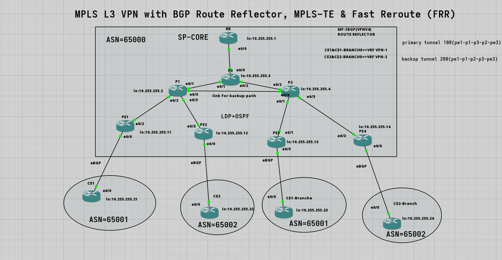

# 🚀 MPLS Traffic Engineering with Fast Reroute — Sub-50ms Failover Protection

Building on top of my previous **MPLS L3VPN topology** (powered by an MP-BGP Route Reflector), I've integrated **MPLS Traffic Engineering (MPLS-TE)** with **Fast Reroute (FRR)** to deliver carrier-grade link resilience.

## 💡 Why This Matters

Standard network routing overloads the shortest path and takes seconds to recover from a link failure — causing dropped calls, frozen streams, and interrupted apps. MPLS-TE fixes core congestion by smartly balancing traffic across all available paths, while Fast Reroute restores connections in under 50 milliseconds. Together, they turn a basic network into a highly reliable core that delivers non-stop uptime for critical enterprise services.

## 🔧 What I Implemented

### MPLS Traffic Engineering
- TE tunnel with RSVP-TE signaling (PE1 → PE3) over the L3VPN core
- Explicit path control: `PE1 → P1 → P3 → P2 → PE3`
- Bandwidth reservation & Autoroute Announce for IGP traffic steering away from the default path

### Fast Reroute (FRR) Protection
- Backup tunnel on P1 protecting the critical `P1 → P3` link
- Backup path: `P1 → P2 → P3`
- Sub-50ms automatic failover acting as Point of Local Repair (PLR) at P1

## 🧪 Failover Test Results

| Metric | Result |
|---|---|
| Simulated Event | P1 → P3 link failure during continuous ICMP traffic across L3VPN customer VRFs |
| Primary Path | PE1 → P1 → P3 → P2 → PE3 |
| Backup Path | PE1 → P1 → P2 → P3 → PE3 |
| Failover Speed | <50 milliseconds |
| Packet Loss | 0 dropped packets out of 1,000 (100% delivery during cutover) |
| Recovery | Instant, zero-impact traffic redirection |

## 🛠️ Key Technologies & Concepts

- MP-BGP with Route Reflector (iBGP Scaling)
- MPLS L3VPN (VRFs, MP-BGP, LDP)
- RSVP-TE Signaling & CSPF Path Calculation
- Fast Reroute Link Protection
- Point of Local Repair (PLR) & Pre-established Backup Tunnels
